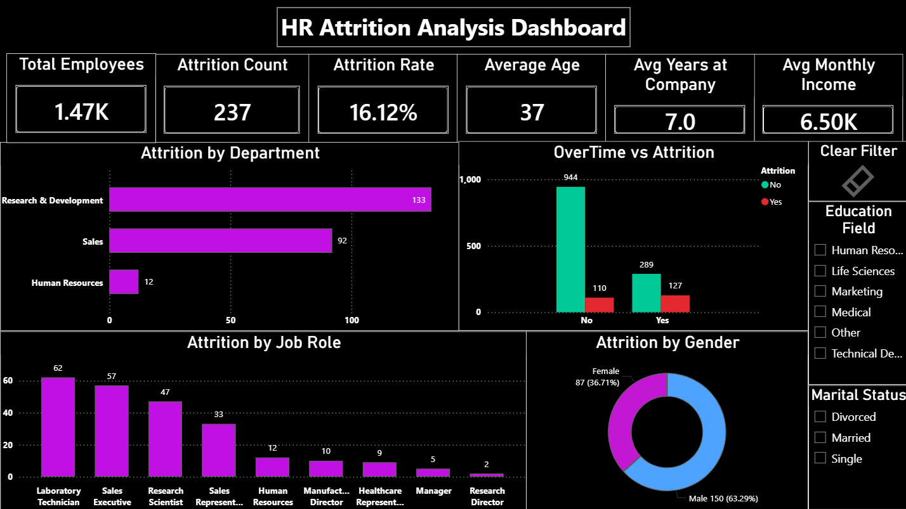
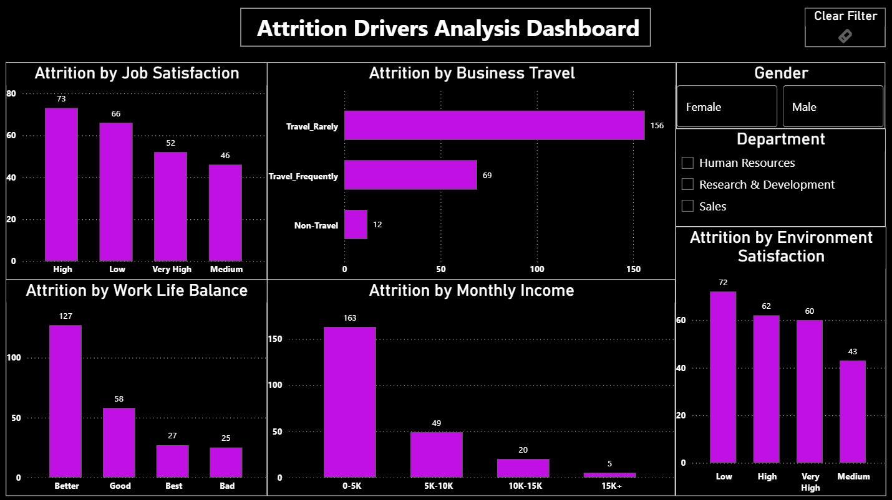

# HR Attrition Analysis

## Project Overview

This project analyzes employee attrition data using SQL, Python, and Power BI to identify key factors influencing employee turnover. The analysis focuses on employee demographics, department performance, job roles, overtime, business travel, job satisfaction, work-life balance, and income levels.

## Tools & Technologies

* SQL Server
* Power BI
* Python
* Excel

## Key Metrics

* Total Employees: 1,470
* Attrition Count: 237
* Attrition Rate: 16.12%
* Average Age: 37
* Average Years at Company: 7.0
* Average Monthly Income: 6.5K

---

## Dashboard 1: HR Attrition Analysis Dashboard

### Key Insights

* Research & Development recorded the highest attrition count.
* Sales department showed a higher attrition rate compared to other departments.
* Laboratory Technicians and Sales Executives experienced the highest attrition among job roles.
* Overtime employees showed higher employee turnover.

---

## Dashboard 2: Attrition Drivers Analysis Dashboard

### Key Insights

* Travel_Rarely employees accounted for the highest attrition count.
* Low environment satisfaction showed increased employee attrition.
* Lower income groups experienced higher employee turnover.
* Job satisfaction and work-life balance significantly influenced attrition patterns.

---

## SQL Analysis

The SQL analysis includes:

* Overall Employee Attrition Rate
* Department-wise Attrition Analysis
* Job Role Analysis
* Overtime Impact Analysis
* Business Travel Analysis
* Education Field Analysis
* Job Satisfaction Analysis
* Work-Life Balance Analysis
* Income-Based Attrition Analysis

---

## Repository Files

* HR Attrition Visuals.pbix
* HR_Attrition_SQL_Analysis.sql
* HR_Attrition_Data_Check_with_Python.ipynb
* HR_Attrition_Raw.csv

---

## Conclusion

This project provides valuable insights into employee attrition patterns and highlights key factors affecting employee retention. The findings can help organizations make data-driven decisions to improve employee satisfaction and reduce turnover.
